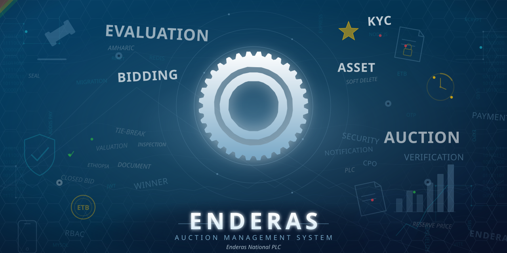
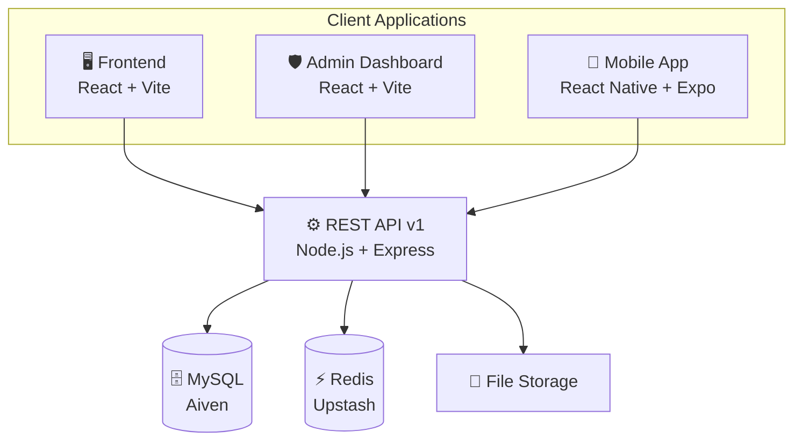

<p align="center">
  
</p>

<h1 align="center">Enderas Auction System</h1>

<p align="center">
  <strong>A full-stack auction management platform for Enderas National PLC</strong>
  <br />
  <sub>Digitizing the complete auction lifecycle — from asset submission to winner payout</sub>
</p>

<p align="center">
  
  
  
  
  
</p>

<p align="center">
  
  
  
  
</p>

<p align="center">
  <a href="#-about">About</a> •
  <a href="#-key-features">Features</a> •
  <a href="#-architecture">Architecture</a> •
  <a href="#-tech-stack">Tech Stack</a> •
  <a href="#-getting-started">Getting Started</a> •
  <a href="#-project-structure">Structure</a> •
  <a href="#-license">License</a>
</p>

---

## 📖 About

The **Enderas Auction System** is an enterprise-grade platform built to digitize and manage the complete auction lifecycle for **Enderas National PLC** — an Ethiopian government enterprise. It handles everything from user registration and KYC verification to asset evaluation, bidding, payment processing, winner selection, and reporting across web, admin, and mobile applications.

---

## ✨ Key Features

| Category | Highlights |
|---|---|
| 🔐 **Authentication & Security** | Mobile OTP registration & login · JWT access/refresh flow · RBAC with 7 roles · bcrypt hashing · SQL injection prevention |
| ⚖️ **Auction Lifecycle** | Asset submission with ownership verification · multi-stage evaluation pipeline · multi-asset lot auctions · closed bidding with deadline enforcement · auto-close background job · timestamp tie-breaking |
| 💳 **Financial** | Addis Pay gateway integration · manual receipt upload & finance review · CPO (Competitive Procurement Order) management · payment-gated document access |
| 🗂️ **Operations** | KYC workflow (upload → review → approve/reject) · in-app, SMS & email notifications · full audit logging · staff & role management · PDF/Excel reporting |
| 🌍 **Platform** | Bilingual (English & Amharic) · responsive web design · cross-platform mobile (Android 10+ / iOS 15+) · zero hardcoded configuration |

---

## 🏗️ Architecture



---

## 🧰 Tech Stack

| Layer | Technology | Purpose |
|---|---|---|
| **Backend** | Node.js + Express.js | REST API server |
| **Database** | MySQL (Aiven) | Primary data store |
| **ORM** | Sequelize | Database abstraction & migrations |
| **Cache** | Redis (Upstash) | RBAC caching & session management |
| **Auth** | JWT + OTP | Authentication & authorization |
| **Frontend** | React + Vite | Public-facing web application |
| **Admin** | React + Vite | Internal management dashboard |
| **Mobile** | React Native + Expo | Cross-platform mobile app |

---

## 🔑 RBAC Roles & Permissions

| Role | Permissions |
|---|---|
| **Super Administrator** | Full system access, evaluation approval, auction publication |
| **Auction Manager** | Create auctions, manage bids & winners |
| **Evaluation Officer** | Schedule inspections, complete valuations |
| **Finance Officer** | Approve/reject payments |
| **Customer Service Officer** | KYC review, asset ownership review, CPO management |
| **Bidder** | Browse auctions, make payments, submit bids |
| **Asset Owner** | Submit assets, track approval status |

---

## 🚀 Getting Started

### Prerequisites

- Node.js 20+
- MySQL / MariaDB
- Redis

### 🔧 Backend

```bash
cd backend
cp .env.example .env    # configure DB_*, JWT_ACCESS_SECRET, REDIS_URL
npm install
npm run db:setup:test   # migrate + seed full test data
npm run dev
```

API runs at `http://localhost:3000/api` by default.

### 🌐 Frontend

```bash
cd frontend
cp .env.example .env    # set VITE_API_BASE_URL
npm install
npm run dev
```

### 🛡️ Admin

```bash
cd admin
cp .env.example .env
npm install
npm run dev
```

### 📱 Mobile

```bash
cd mobile
npm install
npx expo start
```

---

## 🗄️ Database

All database operations are handled through the unified CLI. Migrations live in `backend/migrations/` and seeding is managed by `backend/scripts/db/cli.mjs`.

```bash
npm run db:setup:test        # migrate + seed full test data (recommended for new DBs)
npm run db:setup:normal      # migrate + seed baseline only
npm run db:seed:test         # seed test data on an already-migrated DB
npm run db:reseed:test       # purge test data, then re-seed
npm run db:reset:test        # undo all migrations, migrate, re-seed (destructive)
npm run db:seed:auctions     # seed only the auction catalog
```

Generic form: `npm run db -- <command> [normal|test] [--only=users,staff,auctions]`

| Migration | Purpose |
|---|---|
| `001_initial_schema.cjs` | Complete unified schema — all 23 tables, indexes, constraints, and seed data |

---

## 📁 Project Structure

```
enderass/
├── backend/                  # Node.js + Express REST API
│   ├── app.js                # Express app setup
│   ├── server.js             # Server entry point
│   ├── .env / .env.example   # Environment configuration
│   ├── .sequelizerc          # Sequelize CLI config
│   ├── migrations/           # Database migrations
│   ├── scripts/
│   │   └── db/               # Unified migrate/seed CLI
│   │       ├── cli.mjs
│   │       ├── data/         # Stable seed IDs & catalog
│   │       ├── lib/          # Migration & purge helpers
│   │       └── seeds/        # Baseline, users, auctions
│   ├── src/
│   │   ├── config/           # DB, env, Redis, i18n
│   │   ├── constants/
│   │   ├── controllers/
│   │   ├── core/authorization/  # RBAC engine & middleware
│   │   ├── integrations/
│   │   ├── jobs/             # Auction auto-close
│   │   ├── locales/          # en, am
│   │   ├── middleware/
│   │   ├── models/
│   │   ├── modules/auth/     # Auth routes, service, validation
│   │   ├── routes/           # API versioning
│   │   ├── schemas/
│   │   ├── services/
│   │   ├── utils/
│   │   └── validations/
│   ├── tests/
│   │   ├── rbac.policy.test.js
│   │   └── mobile.util.test.js
│   └── uploads/              # Local file storage
├── frontend/                 # React + Vite public web app
├── admin/                    # React + Vite admin dashboard
└── mobile/                   # React Native + Expo mobile app
```

---

## ⚙️ Environment Variables

All configuration lives in `.env`. Nothing is hardcoded.

| Variable | Description |
|---|---|
| `NODE_ENV` | Environment mode |
| `PORT` | Server port |
| `DB_HOST`, `DB_PORT`, `DB_NAME`, `DB_USER`, `DB_PASSWORD` | MySQL connection |
| `REDIS_URL` | Redis connection string |
| `JWT_ACCESS_SECRET`, `JWT_ACCESS_EXPIRES_IN`, `JWT_REFRESH_EXPIRES_IN` | Auth tokens |
| `CLIENT_URL`, `API_BASE_URL` | Frontend & API URLs |
| `AUCTION_AUTO_CLOSE_ENABLED`, `AUCTION_AUTO_CLOSE_INTERVAL_MS` | Auto-close job |
| `STORAGE_PROVIDER`, `STORAGE_UPLOAD_DIR`, `STORAGE_MAX_FILE_SIZE` | File storage |

See `backend/.env.example` for the full list.

---

## 📜 NPM Scripts

```bash
npm run dev               # Start with --watch
npm run start             # Production start
npm run test               # RBAC policy unit tests
npm run test:auction-flow  # Integration smoke test
```

---

## 📄 License

This project is proprietary software of **Enderas National PLC**. All rights reserved.

---

<p align="center">
  Built with precision for the Ethiopian auction ecosystem 🇪🇹
</p>