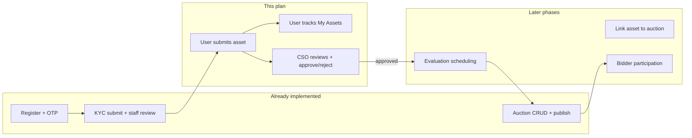

# Asset Request Implementation Plan

**Status:** Implemented — 2026-06-23  
**Scope:** User/asset-owner asset submission + in-app tracking + staff ownership review (CSO)  
**Out of scope for this plan:** Evaluations, auction participation, payments, CPO, bids, winners, notifications delivery (SMS/email)

---

## 1. Executive summary

RBAC, authentication, KYC, and staff auction publishing are **already implemented**. The next lifecycle step is **asset requesting from the user side**:

1. A **KYC-approved** user (role: `asset_owner` or `bidder` with asset permissions) submits an asset with ownership proof.
2. The asset enters **`pending_review`**.
3. The user tracks status in **My Assets**.
4. A **Customer Service Officer** (or `super_admin`) reviews ownership documents and **approves** or **rejects** the request.

This plan describes how to implement that slice **without rewriting** auth, KYC, or the auction admin module. The approach is **incremental stub replacement**: add Sequelize models + `asset.service.js`, swap `/api/v1/assets` stub handlers for real controllers, and wire existing frontend routes (`/app/submit-asset`, `/app/my-assets`, `/app/assets`).

---

## 2. Lifecycle position



| Actor | Stage | This plan |
|-------|-------|-----------|
| User / asset owner | Phase 2 — Asset submission | **In scope** |
| User / asset owner | Phase 3 — Evaluation tracking | **Out of scope** (read-only status field only) |
| CSO | Stage 2 — Asset ownership review | **In scope** |
| Eval officer | Stage 3 — Evaluation | **Out of scope** |
| Auction manager | Stage 4 — Auction creation | **No changes** (already done) |

---

## 3. Requirements (from SRS)

### 3.1 User submission

After `users.status === active` (KYC approved), the user can:

- Submit asset details: title, type/category, description, location/address.
- Upload **ownership proof** matched to asset type:
  | Asset type (DB `asset_type`) | Required ownership document (`ownership_document_type`) |
  |------------------------------|-----------------------------------------------------------|
  | `vehicle` | `vehicle_registration_book` |
  | `land` | `title_deed` |
  | `building` | `ownership_certificate` |
  | `machinery` | `purchase_documents` |
  | `other` | `other` (free choice) |
- Submit optional additional supporting documents (JSON array).
- See submission status: `pending_review`, `approved`, `rejected`, `under_evaluation`, `evaluated`, etc.

### 3.2 Staff review (CSO)

Staff with `assets` + `approve` / `reject` can:

- List all asset requests with filters (status, search).
- View detail including owner info and document URLs.
- Approve → asset status `approved` (ready for evaluation in a later phase).
- Reject → asset status `rejected` with `rejection_reason`.

### 3.3 Non-goals (this phase)

- Physical evaluation scheduling, valuation, photos, reports.
- SMS/email/in-app notification dispatch (hook stubs only).
- Linking approved assets to auction creation (`asset_id` on auctions).
- Asset owner profile editing UI (auto-create minimal `asset_owners` row on first submit).
- Delete asset after submission (optional; defer unless needed).

---

## 4. Current state (code truth)

### 4.1 Backend — what exists

| Area | Status | Location |
|------|--------|----------|
| Auth + OTP | Done | `backend/src/modules/auth/` |
| KYC full flow | Done | `backend/src/services/kyc.service.js` |
| RBAC + KYC gate | Done | `backend/src/core/authorization/`, `kyc.middleware.js` |
| Auction CRUD | Done | `backend/src/services/auction.service.js` |
| File upload | Done | `backend/src/controllers/fileUpload.controller.js` |
| **Assets API** | **Stub** | `v1.routes.js` → `createResourceHandlers('assets')` |
| **Asset models** | **Missing** | No `asset.model.js`, `assetOwner.model.js` |
| **Asset service** | **Missing** | No `asset.service.js` |

Stub response shape today: `{ items: [], message: '... authorized' }` — no DB writes.

### 4.2 Database — schema ready

Tables exist in `docs/enderass_auction.sql` (no new migration required unless we add columns):

**`asset_owners`**

- `user_id` (unique FK → users)
- Address fields, `status` (`active` | `inactive` | `suspended`)

**`assets`**

- `asset_owner_id` FK → `asset_owners`
- `asset_type`, `title`, `description`, `location`, `address`
- `ownership_document_type`, `ownership_document_url`
- `additional_document_urls` (JSON)
- `status`: `pending_review` → `approved` | `rejected` → `under_evaluation` → `evaluated` → `in_auction` → `sold`
- `reviewed_by_staff_id`, `reviewed_at`, `rejection_reason`
- Paranoid soft delete (`deleted_at`)

### 4.3 Frontend — what exists

| Route | Component | Status |
|-------|-----------|--------|
| `/app/submit-asset` | `ModulePageView` placeholder | **Not wired** |
| `/app/my-assets` | `ModulePageView` placeholder | **Not wired** |
| `/app/assets` | `AssetRequestsView` | **Demo data only** (`DEMO_RECORDS`) |
| — | `asset-request/` module | Stub form, wrong API path (`/asset-requests`) |

Patterns to reuse (do not reinvent):

- Form + file upload: `KYCVerificationView.jsx`, `FileUpload.jsx`
- Staff queue table: `KYCManagementView.jsx`, `SuperAdminDashboardView.jsx`
- Confirm modals: `AuctionSuspendConfirmModal.jsx`, `KYCApproveConfirmModal.jsx`
- API hook: `use-auctions.js`
- Service: `auction-service.js` (`ENV.apiV1Prefix`)

### 4.4 RBAC (seed data)

| Role | Assets permissions | Can submit? | Can review? |
|------|-------------------|-------------|-------------|
| `asset_owner` | create, read, update | Yes (after KYC active) | No |
| `bidder` | — (needs assets module if bidders submit assets) | Only if granted | No |
| `customer_service_officer` | read, approve, reject, update | No | **Yes** |
| `auction_manager` | full assets CRUD + approve/reject | Staff use | Yes |
| `super_admin` | wildcard | Yes | Yes |

**Note:** `asset_owner` role seed already includes `POST/GET/PUT /api/v1/assets`. Bidders submitting assets is a product decision — default: **asset_owner role only** unless seed is extended.

**KYC gate:** `requireKYCVerified` is already on `POST /api/v1/assets` in `v1.routes.js`.

**Data scope:** `DATA_SCOPE_RULES[assets] = 'own_asset_owner'` — service must filter non-staff users to their own `asset_owners.user_id` via join.

---

## 5. Architecture decisions

### 5.1 API path: `/api/v1/assets` (not `/asset-requests`)

Backend stubs and RBAC access map use **`/api/v1/assets`**. Frontend `asset-request-service.js` currently calls `/asset-requests` — **must be corrected** to `${ENV.apiV1Prefix}/assets`.

Do **not** add a parallel `/asset-requests` route; avoid duplicate resources.

### 5.2 Auto-create `asset_owners` on first submit

On first `POST /assets`, if no `asset_owners` row exists for `req.user.id`:

- Create `asset_owners` with `user_id`, default `status: active`, optional contact from user profile (`mobile_number`).

No separate “register as asset owner” step in this phase.

### 5.3 Document storage

- Primary ownership doc: `ownership_document_url` (string URL from `/api/v1/files` upload).
- Additional docs: `additional_document_urls` JSON array `[{ name, url, size }]`.
- Same pattern as auction `document_files` / KYC document URLs.

### 5.4 Status transitions (this phase only)

```
                    ┌──────────────┐
   POST /assets ──► │ pending_review│
                    └──────┬───────┘
              approve    │    reject
                    ┌────▼────┐  ┌▼────────┐
                    │ approved │  │ rejected │
                    └──────────┘  └─────────┘
```

- Owner may **update** only while `pending_review` (resubmit docs/details).
- Staff **approve** / **reject** only from `pending_review`.
- Transitions to `under_evaluation` are **evaluation phase** (later).

### 5.5 Notifications

Call `notification.service.js` on approve/reject (currently `console.info`). Persist to `notifications` table in a follow-up; do not block this phase on SMS/email.

### 5.6 What we will NOT change

| Module | Reason |
|--------|--------|
| `auth.service.js`, JWT payload | Session contract stable |
| `kyc.service.js` | Complete |
| `auction.service.js` | Admin UI wired; only optional future `asset_id` validation |
| RBAC middleware chain | Swap handlers only |
| KYC route order (`/kyc/my` before `/kyc/:id`) | Breaking if reordered |
| `SuperAdminDashboardView` / auction drawer | Unrelated |

---

## 6. Backend implementation plan

### 6.1 New files

| File | Purpose |
|------|---------|
| `backend/src/models/assetOwner.model.js` | Sequelize model for `asset_owners` |
| `backend/src/models/asset.model.js` | Sequelize model for `assets` + enums |
| `backend/src/services/asset.service.js` | Business logic |
| `backend/src/controllers/asset.controller.js` | Thin HTTP handlers |

### 6.2 Model associations (`models/index.js`)

```
User ──hasOne──► AssetOwner
AssetOwner ──belongsTo──► User
AssetOwner ──hasMany──► Asset
Asset ──belongsTo──► AssetOwner
Asset ──belongsTo──► Staff (reviewedByStaff)
Staff ──hasMany──► Asset (reviewedAssets)
```

### 6.3 Service functions (`asset.service.js`)

| Function | Description |
|----------|-------------|
| `findOrCreateAssetOwner(userId)` | Get or create owner profile |
| `createAsset(userId, payload)` | Validate, upload refs, status `pending_review` |
| `listAssets({ status, search, tab }, scope)` | Staff: all; owner: scoped by `asset_owner_id` |
| `getAssetById(id, scope)` | Detail + owner name + reviewer |
| `updateAsset(id, userId, payload, scope)` | Owner edit if `pending_review` |
| `approveAsset(id, staffId, notes?)` | → `approved`, audit log |
| `rejectAsset(id, staffId, rejectionReason)` | → `rejected`, audit log |

**Validation rules:**

- `title` required, trimmed.
- `assetType` in enum.
- `ownershipDocumentType` must match asset type (or `other` for `other` type).
- `ownershipDocumentUrl` required (non-empty string).
- User must have `users.status === active` (enforced by `requireKYCVerified` on POST).

**Serialization (API camelCase):**

```json
{
  "id": "uuid",
  "title": "Toyota Hilux 2023",
  "assetType": "vehicle",
  "description": "...",
  "location": "Addis Ababa",
  "address": "...",
  "ownershipDocumentType": "vehicle_registration_book",
  "ownershipDocumentUrl": "https://...",
  "additionalDocuments": [],
  "status": "PENDING_REVIEW",
  "dbStatus": "pending_review",
  "rejectionReason": null,
  "ownerName": "John Doe",
  "ownerMobile": "+251...",
  "submittedAt": "2026-06-23T...",
  "submittedAtFormatted": "23 Jun 2026",
  "reviewedAt": null,
  "reviewedByName": null
}
```

Display status mapping (like auctions): `pending_review` → `PENDING_REVIEW`, `approved` → `APPROVED`, etc.

### 6.4 Routes (`v1.routes.js` changes)

Replace `mountResource` for `/assets` with explicit routes (mirror KYC + auctions pattern):

| Method | Path | Auth | Gate | Handler |
|--------|------|------|------|---------|
| GET | `/assets/my` | Bearer | assets/read | List current user's assets (**register before `/:id`**) |
| GET | `/assets` | Bearer | assets/read + data scope | Staff/owner list |
| GET | `/assets/:id` | Bearer | assets/read + data scope | Detail |
| POST | `/assets` | Bearer | assets/create + **KYC** | Create |
| PUT | `/assets/:id` | Bearer | assets/update + data scope | Update (pending only) |
| POST | `/assets/:id/approve` | Bearer | assets/approve | Staff approve |
| POST | `/assets/:id/reject` | Bearer | assets/reject | Staff reject |

**Do not expose DELETE** in this phase unless product requires withdraw — seed grants DELETE to asset_owner but defer implementation.

### 6.5 Access map updates (`access-map.js`)

Add:

```js
'GET /api/v1/assets/my': { module: MODULES.ASSETS, action: ACTIONS.READ },
```

### 6.6 Audit

Write `audit_logs` on create, approve, reject (same pattern as `kyc.service.js` / `auction.service.js`):

- `action`: `CREATE`, `APPROVE`, `REJECT`
- `entityType`: `Asset`

### 6.7 Migrations

**None required** if base SQL dump + existing tables are applied. Optional migration `020` only if we discover column drift in dev environments.

---

## 7. Frontend implementation plan

### 7.1 Module structure

Consolidate under `Frontend/src/modules/assets/` (align with route `/app/assets`):

```
modules/assets/
├── components/
│   ├── SubmitAssetForm.jsx          # User submission form
│   ├── AssetRequestDetailDrawer.jsx # Staff detail + approve/reject
│   ├── AssetApproveConfirmModal.jsx
│   └── AssetRejectModal.jsx         # Reuse KYC reject pattern (reason required)
├── hooks/
│   ├── use-assets.js                # List hook (staff + filters)
│   └── use-my-assets.js             # Owner-scoped list
├── services/
│   └── asset-service.js             # /v1/assets API
├── utils/
│   └── asset-form-utils.js          # Validation, type→doc mapping
└── views/
    ├── SubmitAssetView.jsx          # /app/submit-asset
    ├── MyAssetsView.jsx             # /app/my-assets
    └── AssetRequestsView.jsx        # /app/assets (staff queue — replace demo)
```

**Deprecate** wrong-path `asset-request-service.js` (`/asset-requests`) — either delete or re-export from `asset-service.js` to avoid breaking imports.

### 7.2 Route wiring (`routes/index.jsx`)

| Path | Component | Permission |
|------|-----------|------------|
| `/app/submit-asset` | `SubmitAssetView` | `assets` / `create` |
| `/app/my-assets` | `MyAssetsView` | `assets` / `read` |
| `/app/assets` | `AssetRequestsView` | `assets` / `read` (staff) |

### 7.3 Navigation (`navigation.config.js`)

Add to `PAGE_REGISTRY` (backend already has entries in `PAGE_ACCESS_REGISTRY`):

```js
{ id: 'my-assets', label: 'My Assets', path: '/app/my-assets', module: MODULES.ASSETS, action: ACTIONS.READ, group: 'owner' },
{ id: 'submit-asset', label: 'Submit Asset', path: '/app/submit-asset', module: MODULES.ASSETS, action: ACTIONS.CREATE, group: 'owner' },
```

Ensures `asset_owner` sees sidebar entries after login.

### 7.4 User flows

**Submit Asset (`SubmitAssetView`)**

1. Check KYC active (route guard + banner already handle this).
2. Form fields: title, asset type select, description, location, address.
3. Ownership doc type auto-selected from asset type (read-only hint).
4. `FileUpload` for primary ownership document + optional additional PDFs/images.
5. Submit → `POST /v1/assets` → toast → redirect to `/app/my-assets`.

**My Assets (`MyAssetsView`)**

1. `GET /v1/assets/my`
2. Table/cards: title, type, status pill, submitted date.
3. Row click → read-only detail (or inline expand).
4. If `rejected`, show reason + link to resubmit (new submission or PUT if same record rules allow).

### 7.5 Staff flows

**Asset Requests (`AssetRequestsView` refactor)**

1. Replace `DEMO_RECORDS` with `useAssets({ status, search })`.
2. Keep existing CSS: `asset-stats-grid`, `asset-status-pill`, filters.
3. Stats from API (`includeStats=true` query param — optional, like KYC).
4. Row actions: view (drawer), approve (confirm modal), reject (reason modal).
5. `event.stopPropagation()` on action buttons if rows are clickable.

**Detail drawer**

- Owner info, documents (links/open), status timeline placeholder for future evaluation.
- Approve / Reject footer (CSO permissions via `can(ASSETS, APPROVE)`).

### 7.6 i18n

Add keys under `assets.*` in `en.json` and `am.json`:

- Form labels, placeholders, validation errors
- Status labels (`pending_review`, `approved`, `rejected`, …)
- Staff queue headers, approve/reject modals, toasts

### 7.7 Styling

Reuse existing tokens and classes:

- `dashboard-table-*`, `dashboard-filters-*`, `asset-status-pill--*`
- `kyc-modal-*` for confirm/reject modals
- `FileUpload`, `Input`, `Button` components
- No hardcoded colors; `variables.css` semantic tokens only

---

## 8. API contract summary

### POST `/api/v1/assets`

**Request body:**

```json
{
  "title": "string",
  "assetType": "vehicle|land|building|machinery|other",
  "description": "string?",
  "location": "string?",
  "address": "string?",
  "ownershipDocumentType": "vehicle_registration_book|title_deed|...",
  "ownershipDocumentUrl": "string",
  "additionalDocuments": [{ "name": "string", "url": "string", "size": 0 }]
}
```

**Response:** `{ success: true, data: { asset: { ... } } }`

### GET `/api/v1/assets/my`

**Response:** `{ success: true, data: { items: [...] } }`

### GET `/api/v1/assets?status=&search=&tab=`

Staff list with optional filters. Status filter values: `PENDING_REVIEW`, `APPROVED`, `REJECTED`, `UNDER_EVALUATION`, `ALL`.

### POST `/api/v1/assets/:id/approve`

**Body:** `{ "reviewNotes": "optional string" }`

### POST `/api/v1/assets/:id/reject`

**Body:** `{ "rejectionReason": "required string" }`

---

## 9. Implementation order

Execute in this sequence to minimize risk and allow incremental testing.

### Step 1 — Backend foundation (no frontend changes)

1. Add `assetOwner.model.js`, `asset.model.js`, associations.
2. Implement `asset.service.js` (create, list, get, approve, reject).
3. Add `asset.controller.js`.
4. Replace asset stubs in `v1.routes.js`; add `GET /assets/my`.
5. Update `access-map.js` for `/assets/my`.
6. Manual API test with Postman/curl (staff + asset_owner tokens).

**Checkpoint:** `POST /assets` persists row; `GET /assets/my` returns owner rows; CSO can approve/reject.

### Step 2 — Frontend service + hooks

1. Create `asset-service.js` (`/v1/assets`).
2. Add `use-assets.js`, `use-my-assets.js`.
3. Add `asset-form-utils.js`.

**Checkpoint:** Hooks return real data in console test page (optional temporary route).

### Step 3 — User-facing UI

1. `SubmitAssetView` + `SubmitAssetForm`.
2. `MyAssetsView`.
3. Wire routes `/app/submit-asset`, `/app/my-assets`.
4. Navigation registry entries.
5. i18n keys.

**Checkpoint:** Asset owner can submit and see list.

### Step 4 — Staff UI

1. Refactor `AssetRequestsView` off demo data.
2. `AssetRequestDetailDrawer`.
3. Approve/reject modals.
4. Toasts + table refresh.

**Checkpoint:** CSO can review queue end-to-end.

### Step 5 — Documentation + status update

1. Update `docs/BACKEND-STATUS.md` (assets: Stub → Complete).
2. Mark this plan **Implemented** with date and PR reference.

---

## 10. Testing plan

### Backend

| Test | Expected |
|------|----------|
| POST without KYC active | 403 from `requireKYCVerified` |
| POST without ownership URL | 400 validation error |
| Owner GET list | Only own assets |
| Staff GET list | All assets |
| Owner approve endpoint | 403 |
| Approve from `pending_review` | Status `approved` |
| Reject without reason | 400 |
| Update after approved | 400 not editable |

### Frontend

| Test | Expected |
|------|----------|
| Submit asset happy path | Redirect to My Assets, row visible |
| Rejected asset shows reason | User can resubmit |
| Staff filter tabs | Correct subset |
| Approve modal | Table refreshes, status updates |
| Row action clicks | Do not navigate away unexpectedly |

### Regression

- KYC submit/review unchanged.
- Auction create/publish/suspend/delete unchanged.
- Login/register/OTP unchanged.

---

## 11. Risks and mitigations

| Risk | Mitigation |
|------|------------|
| `asset_owner` role missing in test DB | Use seed user or assign role in dev |
| Bidder cannot submit assets | Document as asset_owner-only; extend seed if needed |
| VARCHAR(500) URL length for base64 | Use `/v1/files` upload only; reject raw base64 in validation |
| Data scope `own_asset_owner` mismatch | Filter via `AssetOwner.user_id` join, not literal column on `assets` |
| Duplicate `asset-request` vs `assets` services | Single `asset-service.js`; remove wrong paths |
| Staff sees auction UI at `/app/auctions` | Unchanged; CSO uses `/app/assets` for this workflow |

---

## 12. Success criteria

This phase is **done** when:

- [ ] KYC-approved `asset_owner` can submit an asset with ownership proof via `/app/submit-asset`.
- [ ] User sees submissions on `/app/my-assets` with correct status.
- [ ] CSO sees real data on `/app/assets` (no demo records).
- [ ] CSO can approve or reject with audit trail written.
- [ ] No regressions in auth, KYC, or auction admin flows.
- [ ] All user-visible strings use i18n (`en` + `am`).
- [ ] `BACKEND-STATUS.md` reflects assets as implemented.

---

## 13. Follow-up phases (not in this plan)

| Phase | Description | Depends on |
|-------|-------------|------------|
| Evaluation module | Schedule inspection, photos, valuation, `under_evaluation` → `evaluated` | Approved assets |
| Notifications | Persist `notifications` table + SMS/email | Any status change |
| Auction linkage | Require `asset_id` on auction create when linking evaluated asset | Evaluation complete |
| Bidder browse | Published auctions for participation | Auction API + RBAC grant |

---

## 14. File change checklist

### Backend (new)

- [ ] `src/models/assetOwner.model.js`
- [ ] `src/models/asset.model.js`
- [ ] `src/services/asset.service.js`
- [ ] `src/controllers/asset.controller.js`

### Backend (modify)

- [ ] `src/models/index.js`
- [ ] `src/routes/v1.routes.js`
- [ ] `src/core/authorization/access-map.js`

### Frontend (new)

- [ ] `modules/assets/services/asset-service.js`
- [ ] `modules/assets/hooks/use-assets.js`
- [ ] `modules/assets/hooks/use-my-assets.js`
- [ ] `modules/assets/utils/asset-form-utils.js`
- [ ] `modules/assets/components/SubmitAssetForm.jsx`
- [ ] `modules/assets/views/SubmitAssetView.jsx`
- [ ] `modules/assets/views/MyAssetsView.jsx`
- [ ] `modules/assets/components/AssetRequestDetailDrawer.jsx`
- [ ] `modules/assets/components/AssetApproveConfirmModal.jsx`
- [ ] `modules/assets/components/AssetRejectModal.jsx`

### Frontend (modify)

- [ ] `modules/assets/views/AssetRequestsView.jsx`
- [ ] `routes/index.jsx`
- [ ] `config/navigation.config.js`
- [ ] `locales/en.json`, `locales/am.json`

### Docs (after implementation)

- [ ] `docs/BACKEND-STATUS.md`

---

*Review this plan before implementation. Once approved, begin with **Step 1 — Backend foundation**.*
