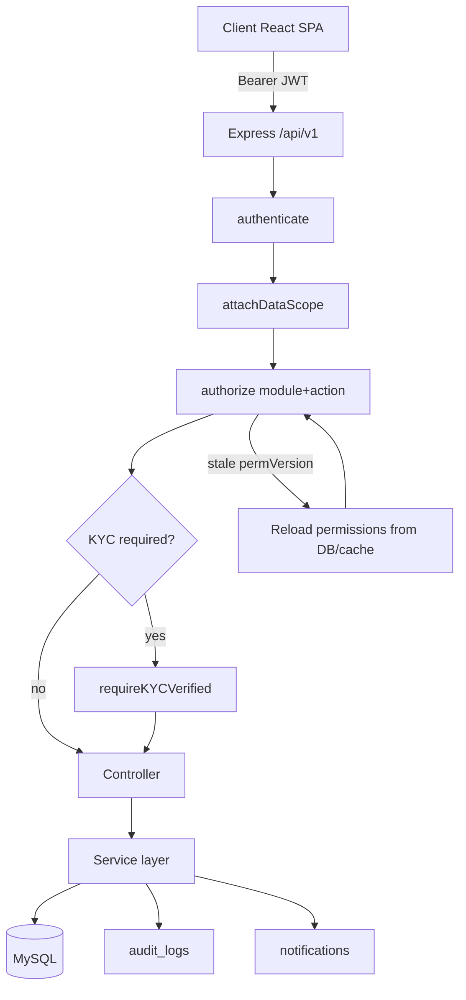

# Enderass Auction Management System — Implementation Report & SRS Comparison

**Document version:** 1.0  
**Report date:** 23 June 2026  
**Codebase:** `enderass-auction-system/`  
**SRS reference:** `docs/Enderass  Auction Management System SRS.pdf` (Version 2.0)  
**Audience:** Business stakeholders, product owners, developers, QA

---

## Table of contents

1. [Executive summary](#1-executive-summary)
2. [Purpose of this report](#2-purpose-of-this-report)
3. [Technology stack & architecture](#3-technology-stack--architecture)
4. [System design & wiring](#4-system-design--wiring)
5. [End-to-end auction lifecycle (as implemented)](#5-end-to-end-auction-lifecycle-as-implemented)
6. [Module-by-module implementation](#6-module-by-module-implementation)
7. [Database & data model](#7-database--data-model)
8. [Security, RBAC & permissions](#8-security-rbac--permissions)
9. [Integrations & infrastructure](#9-integrations--infrastructure)
10. [Frontend application](#10-frontend-application)
11. [SRS scope comparison](#11-srs-scope-comparison)
12. [Functional requirements traceability](#12-functional-requirements-traceability)
13. [Business rules compliance](#13-business-rules-compliance)
14. [Gap analysis & prioritization](#14-gap-analysis--prioritization)
15. [Known limitations & technical debt](#15-known-limitations--technical-debt)
16. [Recommendations & roadmap](#16-recommendations--roadmap)
17. [Appendices](#17-appendices)

---

## 1. Executive summary

The **Enderass Auction Management System** is implemented as a **modular monolith**: a **React 19 + Vite** single-page web application talking to a **Node.js / Express 5** REST API backed by **MySQL** (Sequelize ORM), with **Redis** used for OTP storage and RBAC caching (with graceful degradation when Redis is offline).

### What the SRS asks for (Platform Release)

The SRS (v2.0) defines **17 scope items**, including a full auction lifecycle (registration → KYC → asset submission → evaluation → auction → document purchase → payment → CPO → bidding → winner selection → notifications → reporting), plus **Android and iOS mobile apps**, **Addis Pay**, and **SMS/Email** delivery.

### What is actually built today

| Area | Status |
|------|--------|
| **Web application** | **Largely implemented** — staff and bidder workflows exist end-to-end in the browser |
| **Core auction lifecycle** | **Implemented** in code (KYC through winner selection) |
| **RBAC & staff admin** | **Implemented** — JWT permissions, per-module actions, staff CRUD, role permission matrix |
| **Reporting & dashboard** | **Partial** — SQL metrics + CSV export; no PDF/Excel |
| **Notifications** | **Partial** — in-app DB notifications only; no SMS/email |
| **Payments** | **Partial** — manual receipt upload + finance approval; **no Addis Pay** |
| **Auction documents module** | **Partial** — documents stored as JSON on auctions; dedicated documents UI/API stubbed |
| **Mobile apps (Android/iOS)** | **Not implemented** |
| **Password reset** | **Not implemented** |

**Overall SRS alignment (web platform):** approximately **70–75%** of functional scope is implemented or partially implemented. **Mobile apps and external integrations** remain the largest gaps relative to the SRS.

---

## 2. Purpose of this report

This document:

1. Describes **how the system is designed and wired** (backend, frontend, database, RBAC).
2. Lists **what is actually implemented** as of the report date (not outdated stub notes).
3. Compares implementation against **`Enderass Auction Management System SRS.pdf` v2.0**.
4. Highlights **gaps**, **partial features**, and **recommended next steps**.

---

## 3. Technology stack & architecture

### 3.1 Repository layout

```
enderass-auction-system/
├── backend/          # Node.js ESM REST API
├── Frontend/         # React SPA (Vite)
└── docs/             # SQL schema, seeds, standards, SRS PDF
```

### 3.2 Backend

| Component | Technology |
|-----------|------------|
| Runtime | Node.js (ES modules) |
| Framework | Express 5 |
| ORM | Sequelize 6 + mysql2 |
| Auth | JWT (access) + opaque refresh tokens (DB-stored, no refresh API yet) |
| Cache | Redis (ioredis) + in-process L1 cache |
| Uploads | Multer → local filesystem |
| i18n | i18n (API error messages) |
| Migrations | sequelize-cli (016–026 in repo) |

**Entry flow:**

```
server.js
  → DB connect, start auction-auto-close job
  → app.js (CORS, JSON, i18n, /api/uploads static, /health)
    → routes/index.js
        ├── /api/auth   → modules/auth/
        └── /api/v1     → routes/v1.routes.js (domain API)
```

### 3.3 Frontend

| Component | Technology |
|-----------|------------|
| UI | React 19 |
| Build | Vite 6 |
| Routing | React Router 7 |
| State | Zustand (`auth-store.js` — token in memory only) |
| i18n | i18next (English + Amharic) |
| API | Axios wrapper (`services/api.js`), dev proxy `/api` → port 3000 |

### 3.4 Architectural pattern

**Layered modular monolith:**

```
HTTP Request
  → authenticate (JWT)
  → attachDataScope(module)     # row-level scope metadata
  → authorize({ module, action }) # RBAC policy engine
  → optional requireKYCVerified / requireStaff
  → controller
  → service (business logic)
  → Sequelize models / raw SQL
  → audit log (on mutations)
```

---

## 4. System design & wiring

### 4.1 Authentication wiring

| Step | Implementation |
|------|----------------|
| Register | `POST /api/auth/register` — mobile, password, individual/organization |
| OTP | 6-digit code in Redis (console log in dev; **no SMS gateway**) |
| Verify OTP | `POST /api/auth/verify-otp` → `kyc_pending`, issues session |
| Login | `POST /api/auth/login` — mobile + password (Ethiopian number normalization `09…` / `+251…`) |
| Access token | JWT ~15 min, embeds `identity` + `authz` (`moduleActions`, `permissionVersion`, etc.) |
| Refresh token | Stored hashed in `refresh_tokens` — **no `/auth/refresh` endpoint** |
| Session introspection | `GET /api/v1/auth/me`, `GET /api/v1/auth/navigation` |

**Frontend:** Login/register/OTP views → `auth-store.setSession()` → `ProtectedRoute` gates `/app/*`.

### 4.2 RBAC wiring

Permissions live in **`roles.description`** as JSON:

```json
{
  "summary": "Role description",
  "permissionVersion": 2,
  "permissions": {
    "modules": ["kyc", "assets"],
    "actions": ["read", "approve"],
    "routes": ["GET /api/v1/kyc", "POST /api/v1/kyc/:id/approve"],
    "moduleActions": { "kyc": ["read", "approve"], "assets": ["read"] }
  }
}
```

**Effective role:** `COALESCE(staff.role_id, users.role_id)` for staff with active profile.

**Runtime enforcement:**

1. `access-map.js` — maps every API route → `{ module, action }`
2. `policy.engine.js` + `permission-eval.util.js` — `canAccess(context, module, action)` using **`moduleActions`** (per-module matrix)
3. `authorization.middleware.js` — checks JWT; **re-loads permissions from DB** when `permissionVersion` in token is stale
4. `data-scope.service.js` — filters list queries (own bids, own assets, etc.)

**Staff permission editing:**

- UI: `StaffDetailDrawer` → `StaffPermissionMatrix` (per-module action checkboxes)
- API: `PUT /api/v1/roles/:id` → `role-admin.service.js`
- On save: normalizes actions, bumps `permissionVersion`, invalidates role + **all affected staff** permission caches

**Special permission module — `files`:** Controls the shared upload API (`POST/DELETE /api/v1/files`), used by KYC, assets, auctions, evaluations — not a separate sidebar page.

### 4.3 Cross-cutting concerns

| Concern | Wiring |
|---------|--------|
| **Audit** | `audit.service.js` writes to `audit_logs` on login, mutations, access denied |
| **Notifications** | `notification.service.js` persists in-app rows; helpers called from KYC/asset/payment/CPO/winner flows |
| **File storage** | `fileStorage.integration.js` (local disk); served at `/api/uploads` |
| **Settings** | `system_settings` table — currency, CPO %, min bid increment, OTP TTL, languages |
| **Auto-close** | `auction-auto-close.job.js` polls every 60s, closes expired `published` auctions, triggers winner auto-selection |

### 4.4 Request flow diagram



---

## 5. End-to-end auction lifecycle (as implemented)

This matches SRS Phases 1–7 for the **web** channel:

```
1. Register → OTP verify → Login
2. Submit KYC → Staff review (pending / under review / approve / reject)
3. User status → active (can participate)
4. Asset owner submits auction request + documents/photos
5. CSO/staff approves asset → system may auto-create published auction
6. Evaluation officer schedules → starts → completes (valuation, photos) → approves/rejects
7. Auction manager manages auction (publish/suspend/close) OR auto-close at end_date
8. Bidder browses auctions (bids:read)
9. Bidder pays document fee (manual receipt) → finance approves
10. Bidder uploads CPO → staff approves
11. Bidder places closed bid (one per auction, not editable)
12. Auction closes → auto-select highest valid bid if reserve met
13. Staff confirms/declines/replaces winner → in-app notification
```

**Participation gates (enforced in services):**

- `users.status === active` (KYC approved)
- Approved document payment for auction
- Approved CPO for auction
- Auction `published` and within date window
- Bid ≥ reserve price and ≥ min increment (from settings)

---

## 6. Module-by-module implementation

Legend: ✅ Implemented · ⚠️ Partial · ❌ Not implemented / stub

### 6.1 User registration & authentication

| SRS area | Status | Implementation |
|----------|--------|----------------|
| Mobile registration + OTP | ⚠️ | ✅ Flow works; OTP logged to console, not SMS |
| Duplicate mobile | ✅ | Unique constraint + validation |
| Duplicate National ID / TIN | ✅ | Checked on KYC submit |
| Login mobile/password | ✅ | `auth.service.js` |
| Email login | ❌ | Mobile-only in validation |
| Password reset (OTP) | ❌ | No routes |
| Secure password hashing | ✅ | bcrypt |
| Organization documents at registration | ⚠️ | Collected at KYC step, not at register |

**Key files:** `backend/src/modules/auth/`, `Frontend/src/modules/auth/`, `Frontend/src/modules/users/views/LoginView.jsx`

---

### 6.2 KYC verification

| SRS area | Status | Implementation |
|----------|--------|----------------|
| Upload ID documents | ✅ | Individual + organization doc sets |
| Staff review | ✅ | Tabs: pending, under_review, approved, rejected |
| Approve / reject | ✅ | Updates user status + KYC record |
| KYC notifications | ⚠️ | In-app only |
| Audit trail | ✅ | `GET /kyc/:id/audit` |

**Key files:** `kyc.service.js`, `KYCManagementView.jsx`, `KYCManagementDetailDrawer.jsx` (approve/reject gated by `kyc:approve` / `kyc:reject`)

---

### 6.3 Asset owner management & asset submission

| SRS area | Status | Implementation |
|----------|--------|----------------|
| Owner profile | ⚠️ | `asset_owners` auto-created; limited profile UI |
| View submitted assets | ✅ | `MyAssetsView.jsx` |
| Track approval status | ✅ | Status pills + detail |
| Submit asset + ownership docs | ✅ | Wizard/form + file upload |
| Staff approve/reject | ✅ | `AssetRequestsView.jsx` |
| Notifications | ⚠️ | In-app |
| Auto auction on approve | ✅ | `createPublishedAuctionFromApprovedAsset()` |

**Key files:** `asset.service.js`, `asset.model.js`, `assetOwner.model.js`

---

### 6.4 Asset evaluation

| SRS area | Status | Implementation |
|----------|--------|----------------|
| Schedule inspection | ✅ | Create evaluation for eligible assets |
| Record valuation | ✅ | Complete evaluation with amounts |
| Upload photos | ✅ | Via `/files` → evaluation folder |
| Evaluation report | ⚠️ | Notes/fields in DB; no separate PDF report entity |
| Approve/reject recommendation | ✅ | Staff actions |
| Only approved → auction | ⚠️ | Asset status workflow exists; auction can also be staff-created independently |

**Key files:** `evaluation.service.js`, `EvaluationManagementView.jsx`

---

### 6.5 Auction management

| SRS area | Status | Implementation |
|----------|--------|----------------|
| Create auction | ✅ | Staff CRUD |
| Link to approved asset | ✅ | Optional `asset_id`; auto-link on asset approve |
| Title, description, dates, reserve, document price | ✅ | Migration 019 fields |
| Publish / suspend / close | ✅ | State machine |
| Visible to bidders | ✅ | Browse endpoints (`bids:read`) |
| Auto-close at end time | ✅ | `auction-auto-close.job.js` |
| CPO percentage | ✅ | Per-auction field |

**Key files:** `auction.service.js`, `SuperAdminDashboardView.jsx`, `BrowseAuctionsView.jsx`

---

### 6.6 Auction document management

| SRS area | Status | Implementation |
|----------|--------|----------------|
| Staff upload auction documents | ✅ | JSON `document_files` on auction + file API |
| Download after payment | ⚠️ | Gated in participation API (`hasApprovedDocumentPayment`); no dedicated download tracking table |
| Track downloads | ❌ | `auction_documents` table in SQL unused |
| PDF support | ✅ | Upload accepts PDFs (mime validation) |
| Dedicated documents module | ❌ | `/app/documents` is placeholder; API stub |

---

### 6.7 Payment management

| SRS area | Status | Implementation |
|----------|--------|----------------|
| Addis Pay integration | ❌ | Not built |
| Manual receipt upload | ✅ | `payment.service.js` |
| Finance approve/reject | ✅ | `PaymentManagementView.jsx` |
| Statuses pending/approved/rejected | ✅ | |
| Payment notifications | ⚠️ | In-app |
| Transaction reports | ⚠️ | Part of dashboard/reports CSV |
| Verified payment → document access | ✅ | `hasApprovedDocumentPayment()` |

---

### 6.8 CPO management

| SRS area | Status | Implementation |
|----------|--------|----------------|
| Upload CPO | ✅ | `MyCpoView.jsx` |
| Staff review/approve/reject | ✅ | `CpoManagementView.jsx` |
| Status tracking | ✅ | |
| CPO required before bid | ✅ | `cpo.service.js` + `bid.service.js` |
| Notifications | ⚠️ | In-app |

---

### 6.9 Closed bid submission

| SRS area | Status | Implementation |
|----------|--------|----------------|
| Bid before close | ✅ | Date + status checks |
| View own bids only (bidder) | ✅ | Data scope + `MyBidsView` |
| Bids not editable | ✅ | One bid per user per auction |
| Auto-close disables bidding | ✅ | Closed auction rejects new bids |
| Timestamp recorded | ✅ | `submitted_at` |
| Real-time bidding | ❌ | Not in SRS (closed bids); no WebSocket |

**Key files:** `bid.service.js`, `PlaceBidForm.jsx`

---

### 6.10 Winner selection

| SRS area | Status | Implementation |
|----------|--------|----------------|
| Staff review after close | ✅ | `WinnerManagementView.jsx` |
| Highest valid bid | ✅ | `getHighestValidBid()` — amount DESC, `submitted_at` ASC (tie-break) |
| Reserve must be met | ✅ | `autoSelectWinner()` |
| Winner recorded | ✅ | `winners` table |
| Decline → replacement | ✅ | `declineWinner`, `replaceWinner` |
| Auto notification | ⚠️ | In-app `sendWinnerAnnouncement` |

---

### 6.11 Notification management

| SRS area | Status | Implementation |
|----------|--------|----------------|
| Event types (KYC, asset, payment, CPO, winner, etc.) | ⚠️ | In-app records created |
| SMS delivery | ❌ | |
| Email delivery | ❌ | |
| In-app notifications | ✅ | `NotificationCenterView.jsx`, unread count in header |

---

### 6.12 Reporting & dashboard

| SRS area | Status | Implementation |
|----------|--------|----------------|
| Dashboard summaries | ✅ | Role-specific SQL metrics |
| Report types (auctions, assets, bidders, payments, CPO) | ⚠️ | Several report types in `report.service.js` |
| Date filters | ✅ | |
| Export PDF | ❌ | |
| Export Excel | ❌ | |
| Export CSV | ✅ | `GET /dashboard/reports/export` |

---

### 6.13 Staff management

| SRS area | Status | Implementation |
|----------|--------|----------------|
| Create staff accounts | ✅ | Linked user + role |
| Activate/deactivate | ✅ | |
| Assign roles | ✅ | On create/edit |
| Edit role permissions | ✅ | Matrix in staff drawer → `PUT /roles/:id` |

**Key files:** `staff.service.js`, `StaffManagementView.jsx`, `StaffPermissionMatrix.jsx`

---

### 6.14 Role-based access control

| SRS area | Status | Implementation |
|----------|--------|----------------|
| Role-based permissions | ✅ | Full matrix |
| Authorized functions only | ✅ | API + frontend `can()` |
| All 7 SRS roles | ✅ | Seeded in DB |

| Role code | Purpose |
|-----------|---------|
| `super_admin` | Wildcard access |
| `auction_manager` | Auctions, assets, bids, winners, CPO |
| `evaluation_officer` | Evaluations, assets |
| `finance_officer` | Payments, reports |
| `customer_service_officer` | Users, KYC, assets, CPO |
| `bidder` | Participate in auctions |
| `asset_owner` | Submit assets (role exists; many users use `bidder` with asset permissions) |

---

### 6.15 Mobile applications

| SRS area | Status |
|----------|--------|
| Android app | ❌ Not in repository |
| iOS app | ❌ Not in repository |

The SRS lists mobile as in-scope for Platform Release; only the **responsive web SPA** exists today.

---

## 7. Database & data model

### 7.1 Schema sources

- **Canonical dump:** `docs/enderass_auction.sql` (base schema + role seeds)
- **Incremental migrations:** `backend/migrations/016`–`026`

### 7.2 Sequelize models (16)

`User`, `Role`, `Staff`, `RefreshToken`, `AuditLog`, `KYCVerification`, `AssetOwner`, `Asset`, `Evaluation`, `Auction`, `Payment`, `Cpo`, `Bid`, `Winner`, `Notification`, `SystemSetting`

### 7.3 SRS entities vs implementation

| SRS entity | Table / storage | Model | Notes |
|------------|-----------------|-------|-------|
| User | `users` | ✅ | |
| Role | `roles` | ✅ | Permissions in JSON `description` |
| KYC Verification | `kyc_verifications` | ✅ | |
| Asset Owner | `asset_owners` | ✅ | |
| Asset | `assets` | ✅ | |
| Ownership Verification | — | ⚠️ | Part of asset approval workflow, not separate entity |
| Evaluation | `evaluations` | ✅ | |
| Auction | `auctions` | ✅ | |
| Auction Document | `auction_documents` | ❌ | Table in SQL unused; `auctions.document_files` JSON used |
| Payment | `payments` | ✅ | |
| CPO | `cpos` | ✅ | |
| Bid | `bids` | ✅ | |
| Winner | `winners` | ✅ | |
| Notification | `notifications` | ✅ | In-app channel only |
| Staff | `staff` | ✅ | |
| Audit Log | `audit_logs` | ✅ | |

### 7.4 Key relationships (implemented)

- User 1—1 KYCVerification  
- User 1—0..1 Staff  
- AssetOwner 1—many Assets  
- Asset 1—0..1 Evaluation  
- Asset 0..1—1 Auction  
- Auction 1—many Bids  
- User 1—many Bids (one active submitted bid per auction enforced in service)  
- Auction 0..1—1 active Winner  
- User 1—many Payments, CPOs, Notifications  

---

## 8. Security, RBAC & permissions

### 8.1 SRS security requirements

| ID | Requirement | Status |
|----|-------------|--------|
| SEC-001 | HTTPS | ⚠️ Deployment concern; dev uses HTTP |
| SEC-002 | Password hashing | ✅ bcrypt |
| SEC-003 | RBAC enforced | ✅ All `/api/v1` domain routes |
| SEC-004 | Failed login logged | ⚠️ Counter incremented; not full audit per attempt |
| SEC-005 | Audit logs | ✅ |
| SEC-006 | File validation | ✅ MIME + size limits |
| SEC-007 | Session timeout | ⚠️ JWT expiry (~15m); no inactivity timeout beyond token TTL |

### 8.2 Permission actions (per module)

Global action vocabulary: `read`, `create`, `update`, `delete`, `approve`, `reject`, `publish`, `close`, `export`.

Each module exposes only actions that map to real API routes (derived from `API_ACCESS_MAP`). Examples:

- **KYC:** read, create, update, approve, reject  
- **Auctions:** read, create, update, delete, publish, close  
- **Roles:** read, update  
- **Files:** create, delete (upload service only)

---

## 9. Integrations & infrastructure

| Integration | SRS | Implemented |
|-------------|-----|-------------|
| **Addis Pay** | Primary payment gateway | ❌ |
| **SMS gateway** | OTP + notifications | ❌ (console OTP in dev) |
| **Email service** | Notifications | ❌ |
| **File storage** | Secure document storage | ✅ Local disk (`STORAGE_PROVIDER=local`) |
| **Redis** | Caching / OTP | ✅ With fallback |
| **MySQL** | Primary database | ✅ Required |

### Background jobs

| Job | Purpose | Config |
|-----|---------|--------|
| `auction-auto-close.job.js` | Close auctions when `end_date` passed | `AUCTION_AUTO_CLOSE_ENABLED`, `AUCTION_AUTO_CLOSE_INTERVAL_MS` |

---

## 10. Frontend application

### 10.1 Route map (`/app/*`)

| Path | View | Permission |
|------|------|------------|
| `/app/dashboard` | Role dashboards | varies |
| `/app/users` | User management | `users:read` |
| `/app/staff` | Staff management | `staff:read` |
| `/app/roles` | **Audit trail** (not role CRUD UI) | `roles:read` |
| `/app/kyc` | KYC management | `kyc:read` |
| `/app/assets` | Asset requests (staff) | `assets:read` |
| `/app/my-assets` | Owner assets | `assets:read` |
| `/app/evaluations` | Evaluations | `evaluations:read` |
| `/app/auctions` | Auction management | `auctions:read` |
| `/app/browse-auctions` | Bidder browse | `bids:read` |
| `/app/bids`, `/app/my-bids` | Bid management / my bids | `bids:read` |
| `/app/payments`, `/app/my-payments` | Payments | `payments:read` |
| `/app/cpo`, `/app/my-cpo` | CPO | `cpo:read` |
| `/app/winners` | Winners | `winners:read` |
| `/app/reports` | Reports | `dashboard:export` |
| `/app/notifications` | Notification center | `notifications:read` |
| `/app/settings` | Settings (localization UI) | `settings:read` |
| `/app/documents` | **Placeholder** | `documents:read` |
| `/app/profile` | User profile | `users:read` |

### 10.2 i18n

- **English** and **Amharic** locale files: `Frontend/src/locales/en.json`, `am.json`
- Matches SRS language requirement for **web** only

### 10.3 Auth UX

- KYC gating routes: `/complete-profile`, `/kyc-under-review`, `/kyc-rejected`
- Sidebar filtered by `GET /api/v1/auth/navigation` + client `can()`

---

## 11. SRS scope comparison

SRS §2 lists **17 Platform Release modules**. Comparison:

| # | SRS module | Web implementation | Mobile |
|---|------------|-------------------|--------|
| 1 | User Registration & Authentication | ⚠️ Partial (no reset, no SMS OTP) | ❌ |
| 2 | Basic KYC Verification | ✅ | ❌ |
| 3 | Asset Owner Management | ⚠️ Partial | ❌ |
| 4 | Asset Submission & Ownership Verification | ✅ | ❌ |
| 5 | Asset Evaluation Management | ✅ | ❌ |
| 6 | Auction Management | ✅ | ❌ |
| 7 | Auction Document Management | ⚠️ Partial | ❌ |
| 8 | Payment Management | ⚠️ Partial (manual only) | ❌ |
| 9 | Simplified CPO Management | ✅ | ❌ |
| 10 | Closed Bid Submission | ✅ | ❌ |
| 11 | Winner Selection | ✅ | ❌ |
| 12 | Notification Management | ⚠️ In-app only | ❌ |
| 13 | Reporting & Dashboard | ⚠️ Partial (no PDF/Excel) | ❌ |
| 14 | Staff Management | ✅ | ❌ |
| 15 | Role-Based Access Control | ✅ | ❌ |
| 16 | Android Mobile Application | — | ❌ |
| 17 | iOS Mobile Application | — | ❌ |

---

## 12. Functional requirements traceability

Summary by SRS section. **✅ Met · ⚠️ Partial · ❌ Not met**

### §5.1 Authentication (FR-AUTH-001 – 006)

| ID | Status | Notes |
|----|--------|-------|
| FR-AUTH-001 | ⚠️ | OTP flow without SMS |
| FR-AUTH-002 | ✅ | Mobile, national ID, TIN duplicates |
| FR-AUTH-003 | ⚠️ | Org docs at KYC, not registration |
| FR-AUTH-004 | ⚠️ | Mobile + password; email login not supported |
| FR-AUTH-005 | ❌ | No password reset |
| FR-AUTH-006 | ✅ | bcrypt |

### §5.2 KYC (FR-KYC-001 – 004)

| ID | Status |
|----|--------|
| FR-KYC-001 | ✅ |
| FR-KYC-002 | ✅ |
| FR-KYC-003 | ✅ |
| FR-KYC-004 | ⚠️ In-app only |

### §5.3 Asset owner (FR-OWNER-001 – 003)

| ID | Status |
|----|--------|
| FR-OWNER-001 | ⚠️ Basic |
| FR-OWNER-002 | ✅ |
| FR-OWNER-003 | ✅ |

### §5.4 Assets (FR-ASSET-001 – 005)

| ID | Status |
|----|--------|
| FR-ASSET-001 – 004 | ✅ |
| FR-ASSET-005 | ⚠️ In-app only |

### §5.5 Evaluation (FR-EVAL-001 – 006)

| ID | Status |
|----|--------|
| FR-EVAL-001 – 005 | ✅ |
| FR-EVAL-006 | ⚠️ Workflow exists; not strictly enforced at auction create |

### §5.6 Auction (FR-AUC-001 – 006)

| ID | Status |
|----|--------|
| FR-AUC-001 – 006 | ✅ |

### §5.7 Documents (FR-DOC-001 – 004)

| ID | Status |
|----|--------|
| FR-DOC-001 | ✅ Via auction JSON + files API |
| FR-DOC-002 | ⚠️ Payment gate in API |
| FR-DOC-003 | ❌ No download tracking |
| FR-DOC-004 | ✅ PDF allowed |

### §5.8 Payment (FR-PAY-001 – 008)

| ID | Status |
|----|--------|
| FR-PAY-001 | ❌ Addis Pay |
| FR-PAY-002 – 004 | ✅ Manual path |
| FR-PAY-005 | ✅ |
| FR-PAY-006 | ⚠️ In-app |
| FR-PAY-007 | ⚠️ CSV reports |
| FR-PAY-008 | ✅ |

### §5.9 CPO (FR-CPO-001 – 005)

| ID | Status |
|----|--------|
| FR-CPO-001 – 004 | ✅ |
| FR-CPO-005 | ⚠️ In-app |

### §5.10 Bids (FR-BID-001 – 005)

| ID | Status |
|----|--------|
| FR-BID-001 – 005 | ✅ |

### §5.11 Winner (FR-WIN-001 – 004)

| ID | Status |
|----|--------|
| FR-WIN-001 – 003 | ✅ |
| FR-WIN-004 | ⚠️ In-app |

### §5.12 Notifications (FR-NOT-001 – 002)

| ID | Status |
|----|--------|
| FR-NOT-001 | ⚠️ Events covered in-app |
| FR-NOT-002 | ❌ SMS/Email; ✅ In-app |

### §5.13 Reporting (FR-REP-001 – 003)

| ID | Status |
|----|--------|
| FR-REP-001 | ✅ |
| FR-REP-002 | ⚠️ Subset of report types |
| FR-REP-003 | ⚠️ Date filters + CSV only |

### §5.14 Staff (FR-STAFF-001 – 003)

| ID | Status |
|----|--------|
| FR-STAFF-001 – 003 | ✅ |

### §5.15 RBAC (FR-RBAC-001 – 003)

| ID | Status |
|----|--------|
| FR-RBAC-001 – 003 | ✅ |

---

## 13. Business rules compliance

| Rule | SRS | Implemented |
|------|-----|-------------|
| BR-001 | Only approved users participate | ✅ `requireKYCVerified`, `status === active` |
| BR-002 | Only approved assets auctioned | ⚠️ Asset approval workflow; staff can also create auctions directly |
| BR-003 | Verified payments grant document access | ✅ |
| BR-004 | Approved CPO required to bid | ✅ |
| BR-005 | Bids after close rejected | ✅ |
| BR-006 | Highest valid bid wins | ✅ |
| BR-007 | Reserve price must be met | ✅ |
| BR-008 | Tie → earliest timestamp | ✅ `ORDER BY amount DESC, submitted_at ASC` |
| BR-009 | Winner decline → next bidder | ✅ `replaceWinner` |

---

## 14. Gap analysis & prioritization

### Critical gaps (SRS Platform Release)

| Gap | Impact | Priority |
|-----|--------|----------|
| **No mobile apps** | SRS explicitly requires Android + iOS | P0 for full SRS compliance |
| **No Addis Pay** | Primary payment path missing | P0 |
| **No SMS OTP / notifications** | Production registration & alerts | P0 |
| **No password reset** | FR-AUTH-005 | P1 |
| **No email notifications** | FR-NOT-002 | P1 |
| **No refresh token API** | Poor UX when JWT expires | P1 |

### Functional partial gaps

| Gap | Priority |
|-----|----------|
| Documents module UI + download tracking (`auction_documents`) | P2 |
| PDF/Excel report export | P2 |
| Dedicated role management page (`/app/roles` shows audit only) | P2 |
| `GET /roles` list API stub | P2 |
| Bidder/asset_owner `files:create` for uploads (if not granted) | P2 |
| Settings UI for all `system_settings` keys | P3 |
| Email verification (`is_email_verified` unused) | P3 |

### Implemented beyond older internal docs

The file `docs/BACKEND-STATUS.md` (dated 2026-06-25) still lists many modules as **stub**; the live codebase has since implemented users, staff, assets, evaluations, payments, CPO, bids, winners, notifications, dashboard, and auction auto-close. **This report reflects the current codebase**, not that outdated status doc.

---

## 15. Known limitations & technical debt

1. **Refresh tokens** issued but no `/api/auth/refresh` or logout revocation API.  
2. **Redis** optional at runtime for reads; role cache invalidation degrades safely when offline.  
3. **Document URLs** may be base64 in DB — `VARCHAR(500)` can truncate long payloads.  
4. **No WebSocket** — bid UI uses refresh/polling.  
5. **Single file storage provider** — `local` only; cloud providers throw if configured.  
6. **Migration history** — migrations 001–015 not in repo as files; base from SQL dump.  
7. **`auction_documents` table** orphaned — design drift from SRS entity model.  
8. **Session permission UI** — frontend `can()` uses login JWT until page refresh; backend enforces fresh permissions on API calls.

---

## 16. Recommendations & roadmap

### Phase A — Production readiness (web)

1. SMS OTP provider + password reset flow  
2. `POST /api/auth/refresh` + logout  
3. Addis Pay integration (initiate, webhook, status sync)  
4. Grant `files:create` to bidder/asset_owner roles (or derive from module permissions)  
5. Email notification channel (optional parallel to SMS)

### Phase B — SRS document module

1. Implement `auction_documents` or formalize JSON pattern with download audit  
2. Build `/app/documents` UI  
3. PDF/Excel export for reports

### Phase C — Mobile (SRS §10)

1. Shared API client against existing `/api/v1`  
2. Android + iOS apps covering US-001 – US-008 flows

### Phase D — Hardening

1. Integration/E2E tests for full lifecycle  
2. Align `enderass_auction.sql` with migrations 016–026  
3. HTTPS deployment checklist (SEC-001)  
4. Real role management UI at `/app/roles`

---

## 17. Appendices

### A. API base URLs

| Environment | URL |
|-------------|-----|
| API | `http://localhost:3000/api` |
| Auth | `http://localhost:3000/api/auth` |
| V1 | `http://localhost:3000/api/v1` |
| Frontend dev | `http://localhost:5173` |

### B. Test credentials

| Role | Mobile | Password |
|------|--------|----------|
| Super Admin | `0912345678` | `pass1` |
| Bidder | `0987654321` | `pass2` |

Operational staff seeds: `docs/seed-rbac-operational-staff.sql` (managers/officers, password `pass1`).

### C. Key documentation files

| File | Purpose |
|------|---------|
| `docs/Enderass  Auction Management System SRS.pdf` | Requirements baseline |
| `docs/enderass_auction.sql` | DB schema + role seeds |
| `docs/BACKEND-STATUS.md` | Developer notes (partially outdated) |
| `docs/IMPLEMENTATION-AND-SRS-COMPARISON-REPORT.md` | This report |

### D. Core source index

| Area | Path |
|------|------|
| V1 routes | `backend/src/routes/v1.routes.js` |
| Access map / RBAC | `backend/src/core/authorization/access-map.js` |
| Role permissions | `backend/src/services/role-admin.service.js` |
| Auth | `backend/src/modules/auth/` |
| Auction + auto-close | `backend/src/services/auction.service.js`, `backend/src/jobs/auction-auto-close.job.js` |
| Frontend routes | `Frontend/src/routes/index.jsx` |
| Permission matrix UI | `Frontend/src/modules/staff/components/StaffPermissionMatrix.jsx` |

---

*End of report. For questions or updates, re-verify against the codebase and SRS PDF after major releases.*
